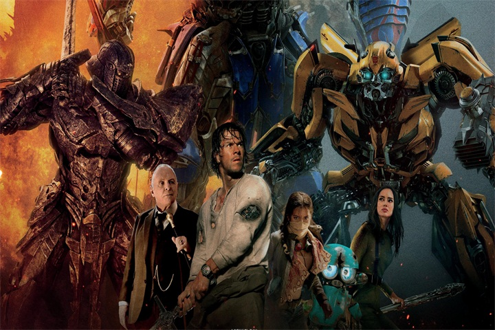

<html lang="en" height="100%">
<head>
    <meta charset="utf-8">
    <meta http-equiv="X-UA-Compatible" content="IE=edge">
    <meta name="viewport" content="width=device-width, initial-scale=1">
    <meta name="description" content="">
    <meta name="author" content="">
    <title>index1</title>
    <!--<link rel="shortcut  icon" type="image/x-icon" hrimagesmges/01.jpg" media="screen"  />-->
    <link rel="stylesheet" type="text/css" href="css/bootstrap-3.3.4.css"><!--http://www.jq22.com/jquery/bootstrap-3.3.4.css-->
    <!--<link rel="stylesheet" type="text/css" href="css/reset.css" />-->
    <link rel="stylesheet" type="text/css" href="css/index2.css" />
    <!--http://www.jq22.com/jquery/jquery-1.7.1.js-->
    

    <!--
        <link rel="stylesheet" type="text/css" href="css/search-form.css">
    -->

    <!--[if IE]>
    
    <![endif]-->
    <!--
        <link rel="stylesheet" href="css/main.css" type="text/css">
    -->

    
    

    <link href="http://libs.baidu.com/bootstrap/3.0.3/css/bootstrap.css" rel="stylesheet">
    
    <meta http-equiv="Content-Type" content="text/html; charset=utf-8" />
    <meta name="viewport" content="initial-scale=1.0, user-scalable=no" />
    
    
    <!--返回顶端-->
    <link rel="stylesheet" href="css/special.css" type="text/css">
    

</head>
<body>

<nav id="mainNav" class="navbar navbar-default navbar-fixed-top hc-top-up">
    

        
        

            <em></em>
        

        <ul id="navBox" class="nav navbar-nav navbar-right hc-navbox">
            <li>
                <a class="nav-on" href="index1.html" >index</a>
                <a class="nav-off" href="index1.html" >首页</a>
            </li>
            <li>
                <a class="nav-on" href="index2.html" >is the film</a>
                <a class="nav-off" href="index2.html">正在热映</a>
            </li>
            <li>
                <a class="nav-on" href="index3.html">coming the film</a>
                <a class="nav-off" href="index3.html">即将上映</a>
            </li>
            <li>
                <a class="nav-on" href="denglu/denglu1.html" target="_blank">registration</a>
                <a class="nav-off" href="denglu/denglu1.html" target="_blank">登录|注册</a>
            </li>
        </ul>

    

</nav>

    

        

            
            
        

        

            
            
        

        

            
            
        

        

            
            
        

        

            
            
        

        

            
            
        

        

            
            
        

        

            
            
        

        

            
            
        

        

            
            
        

        

            
            
        

        

            
            
        

        <a data-u="any" href="#" style="display:none">Image Gallery with Vertical Thumbnail</a>
    

    

        

            

                

                    

                

                

            

        

    

    
    

    

        

            

            

            

                

<a href="single1.html" target="_blank">
                    上映时间:2017-08-03 
主演:刘亦菲 /杨洋 /罗晋 /严屹宽 ... 剧情介绍:青丘帝姬白浅和九重天太子夜华的三生爱恨，三世纠葛...... ">
                </a>

                

<a href="single2.html" target="_blank">
                    上映时间:2017-07-13 
主演:彭于晏 /倪妮 /欧豪 /余文乐 /郑爽... 剧情介绍:这是悟空的故事，彼时孙悟空还不是震撼天地的齐天大圣，他只是只桀傲不驯的猴子...">
                </a>

                

<a href="single3.html" target="_blank">
                    上映时间:2017-07-21 
主演:大鹏 /范伟 /张天爱 /乔杉 /邬君梅 ... 剧情介绍:梦想靠大项目咸鱼翻身的范小兵，始终无法摆脱一个阴影，那就是退伍军人出身的老爹范英雄,小兵油嘴滑舌爱忽悠，英雄刚正不阿会武术...">
                </a>

                

<a href="single4.html" target="_blank">
                    上映时间:2017-8-11 
主演:王大陆/张天爱/任达华/盛冠森... 剧情介绍:个聪明的贼、一个尽职的捕快和一个单纯的王子，一次偶然的相遇,三个人有着各自不同的目的，互相不信任，却不得不共同进入一段奇特的旅行...">
                </a>

                

<a href="single5.html" target="_blank">
                    上映时间:2017-07-28 
主演:刘烨 /朱亚文 /黄志忠 /王景春 /欧豪 /刘昊然 /马天宇 //张艺兴 /李易峰  ... 剧情介绍:《建军大业》是电影“建国三部曲”中的第三部，故事将会围绕“南昌起义”这一重要历史事件展开...">
                </a>

                

<a href="single6.html" target="_blank">
                    上映时间:2017-07-19 
主演:张震/杨幂/张译/雷佳音  ... 剧情介绍:影片故事讲述了北镇抚司锦衣卫沈炼在追查案件中身陷阴谋，为了证明清白，沈炼与少女北斋，同僚裴纶协力查明真相...">
                </a>

                

<a href="single7.html" target="_blank">
                    上映时间:2017-8-11 
主演:刘德华/舒淇/让·雷诺/杨祐宁... 剧情介绍:影片讲述了江洋大盗张丹重出江湖，联手搭档小宝与叶红，在追捕自己多年的法国警探皮埃尔的穷追猛打下，跨越欧洲盗取稀世珍宝的故事 ...">
                </a>

                

<a href="single8.html" target="_blank">
                    上映时间:2017-06-23 
主演:马克•沃尔伯格 /安东尼•霍普金 ... 剧情介绍:变形金刚5有两条线，一条是变形金刚的成长历史，一条是人类的久远历史。变形金刚的成长历史将从变形金刚如何诞生、如何...">
                </a>

                

<a href="single9.html" target="_blank">
                    上映时间:2017-07-28 
主演:陈佩斯/季冠霖 ... 剧情介绍:汉武帝年间，淮南王刘安崇尚仙法，广集豆类练取仙丹，仙丹未炼成，豆子却幻化为人形有了生命，成为了“豆族”。 主人公豆福和刘安一样痴迷于仙术...">
                </a>

                

<a href="single10.html" target="_blank">
                    上映时间:2017-07-28 
主演:吴京/弗兰克.格里罗... 剧情介绍:故事发生在非洲附近的大海上，主人公冷锋遭遇人生滑铁卢，被“开除军籍”，本想漂泊一生的他，正当他打算这么做的时候，一场...">
                </a>

                

<a href="single11.html" target="_blank">
                    上映时间:2017-08-18 
主演:郭富城 /王千源 /刘涛... 剧情介绍:讲述了一段充满戏剧性的犯罪悬疑故事：这是高见翔警官生命中最艰难的一天：老母亲去世，疑似受贿被要求配合调查取证...">
                </a>

                

<a href="single12.html" target="_blank">
                    上映时间:2017-08-11 
主演:廖凡 /李易峰 /万茜 /李纯 /张国柱... 剧情介绍:故事围绕一起连环凶杀案展开，警方面对凶案束手无策，沉默寡言的大学生方木牵扯其中，他天赋奇才、洞悉犯罪心理，协助邰伟和警队破获了...">
                </a>

            

            
            
            

            
            
            
        

    
齐鲁软件大赛胜羽团队

<a class="bshareDiv" href="http://www.bshare.cn/share">分享按钮</a>

    

    

</body>
</html>

